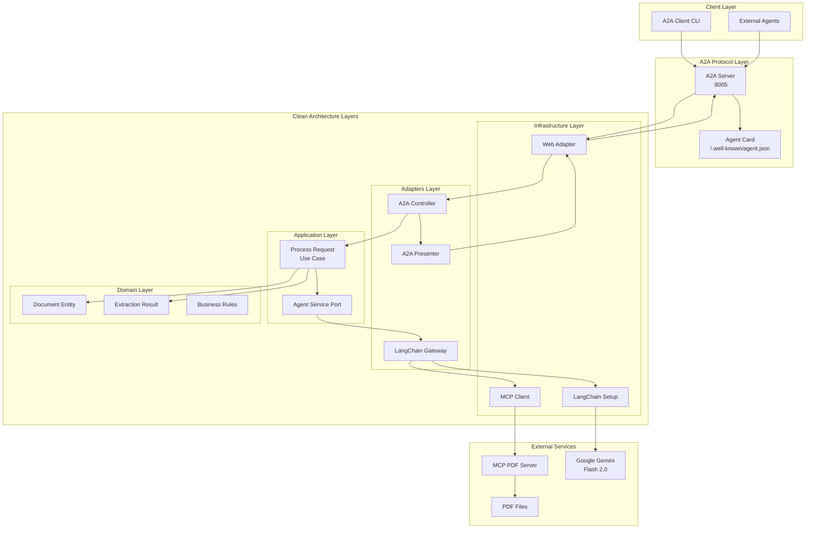
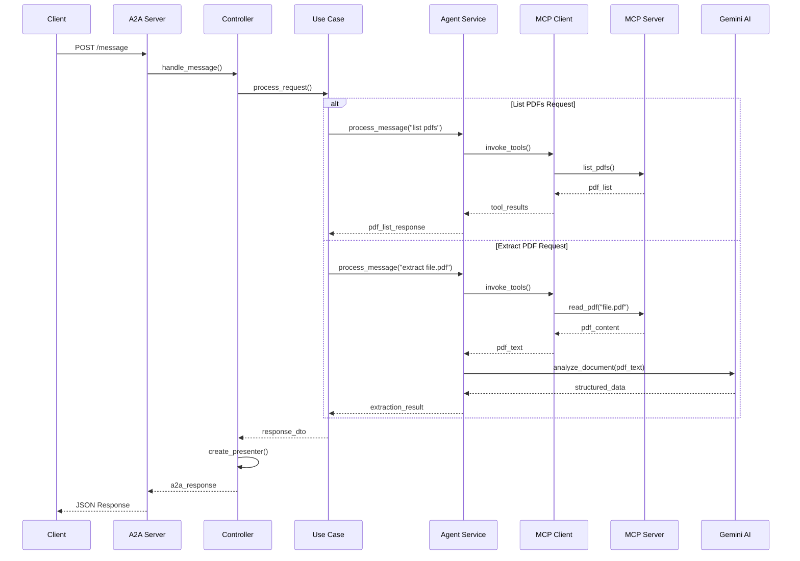

# A2A Document Extraction Agent

An intelligent invoice reading agent specialized in extracting structured data from invoice PDF files using **Google's Gemini Flash 2.0** via **LangChain**, **MCP (Model Context Protocol)** for PDF operations, and **Clean Architecture** for maintainable code. Implements the **A2A (Agent-to-Agent) protocol** for seamless integration with other AI agents.

## Architecture

### System Architecture Diagram



### Request Flow Sequence



## Features

- 🤝 **A2A Protocol**: Interoperable with other AI agents via standardized protocol
- 🧾 **Invoice Specialization**: Expert at reading and understanding invoice documents
- 💰 **Financial Data Extraction**: Extracts amounts, taxes, totals, and line items accurately
- 📅 **Date Recognition**: Identifies invoice dates, due dates, and payment terms
- 🏢 **Entity Extraction**: Extracts vendor and customer information with high accuracy
- 💾 **JSON Export**: Returns structured data via A2A messages
- ✅ **Validation**: File size limits and security checks

## Invoice Data Extraction

The agent specializes in extracting the following invoice fields:
- **Invoice Number**: Unique identifier for the invoice
- **Invoice Date**: Date of issue
- **Due Date**: Payment deadline
- **Vendor Details**: Company name, address, tax ID
- **Customer Details**: Bill-to and ship-to information
- **Line Items**: Product/service descriptions, quantities, unit prices
- **Financial Data**: Subtotal, taxes, discounts, total amount
- **Payment Terms**: Net terms, early payment discounts
- **Purchase Order References**: Related PO numbers
- **Tax Information**: Tax rates and amounts by category

## Setup

### Prerequisites

- Python 3.11+
- Google AI Studio API key (for Gemini Flash 2.0)

### Installation

1. Clone the repository:
```bash
git clone <your-repo-url>
cd read_pdf_agent
```

2. Create and activate virtual environment:
```bash
# Create virtual environment (requires Python 3.11+)
python3 -m venv .venv

# Activate virtual environment
# On macOS/Linux:
source .venv/bin/activate

# On Windows:
# .venv\Scripts\activate
```

3. Install dependencies:
```bash
pip install --upgrade pip
pip install -r requirements.txt
```

4. Create environment configuration:
```bash
cp .env.example .env
```

5. Edit `.env` and add your Google API key:
```env
GOOGLE_API_KEY=your-actual-api-key-here
```

6. Create the PDF directory:
```bash
mkdir -p data/pdfs
```

## Usage

### Quick Start with A2A Protocol

1. **Start the A2A server** (Terminal 1):
```bash
# Make sure virtual environment is activated
source .venv/bin/activate

# Start the server
python3 __main__.py
```

The server will start on `http://localhost:8005` and display:
```
🚀 Starting A2A Document Extraction Agent on 0.0.0.0:8005
📋 Agent card available at: http://0.0.0.0:8005/.well-known/agent.json
💬 Send messages to: http://0.0.0.0:8005/
```

2. **Interact with the agent** (Terminal 2):
```bash
# Make sure virtual environment is activated
source .venv/bin/activate

# Run interactive client (easy way)
python3 client.py

# Or with full client features
python3 a2a_client.py        # Interactive mode
python3 a2a_client.py --test # Run automated tests
```

### Quick Test

To quickly verify everything is working:
```bash
./run_quick_test.sh
```

This will:
- Set up the virtual environment
- Start the server
- Run a quick test (list PDFs)
- Clean up automatically

### Troubleshooting Port Issues

If you get a "port already in use" error:
```bash
# Kill all processes using port 8005
./kill_a2a_servers.sh
```

### Example Interaction

```
🚀 A2A Document Extraction Client
✅ Connected to: Document Extraction Agent
   Version: 1.0.0

📋 Available skills:
   - Extract PDF by Name: Extract structured data from a PDF file...
   - List Available PDFs: Get a list of all PDF files available...

You: list available pdfs

📂 Available PDFs (3):

• bill-of-lading-template.pdf
• invoice-sample.pdf
• customs-declaration.pdf

You: extract invoice-sample.pdf

⏳ Task [a1b2c3d4]: working
🧾 Extracting invoice data from: invoice-sample.pdf

💰 Extracted Invoice Data (application/json)
{
  "document_type": "COMMERCIAL_INVOICE",
  "confidence_score": 0.92,
  "extracted_data": {
    "document_number": "INV-2024-001234",
    "date": "2024-01-15",
    "issuer": "ACME Corporation",
    "recipient": "Customer Inc.",
    "total_amount": "$12,500.00"
  }
}

💬 This document is identified as a COMMERCIAL INVOICE based on...

✅ Task [a1b2c3d4]: completed
```

## Configuration

### Environment Variables

| Variable | Description | Default |
|----------|-------------|---------|
| `GOOGLE_API_KEY` | Google AI Studio API key | Required |
| `PDF_DIR` | Directory containing PDFs | `./data/pdfs` |
| `MCP_PDF_SERVER_COMMAND` | Command to run MCP server | `uv` |
| `MCP_PDF_SERVER_DIR` | Directory where MCP server is located | `/path/to/MCP_pdf_extract` |
| `MCP_PDF_SERVER_ARGS` | Arguments for MCP server | `run python mcp_documents_server.py` |
| `MCP_PDF_TRANSPORT` | MCP transport type | `stdio` |
| `MAX_PDF_SIZE_KB` | Maximum PDF size in KB | `7000` |
| `GEMINI_MODEL` | Gemini model to use | `models/gemini-2.0-flash-exp` |

## Project Structure

```
read_pdf_agent/
├── app/                          # Core application (all logic)
│   ├── a2a/                      # A2A protocol implementation
│   │   ├── __init__.py          # Module initialization
│   │   ├── card.py              # Agent capabilities
│   │   ├── client.py            # A2A client connection
│   │   ├── executor.py          # Request processing
│   │   ├── interaction.py       # Client interaction logic
│   │   └── server.py            # HTTP server setup
│   ├── core/                     # Core functionality
│   │   ├── agent.py             # Main orchestration agent
│   │   └── chains.py            # LangChain pipeline factory
│   ├── models/                   # Data models
│   │   └── schemas.py           # Pydantic models
│   ├── prompts/                  # Prompt templates
│   │   └── extraction.py        # Document analysis prompts
│   ├── services/                 # Business logic
│   │   ├── extraction.py        # Extraction service
│   │   └── mcp_pdf_tools.py     # MCP integration for PDF reading
│   └── exceptions.py            # Custom exceptions
├── data/pdfs/                    # PDF storage directory
├── __main__.py                   # A2A server entry point
├── a2a_client.py                 # Full A2A client implementation
├── client.py                     # Simple client wrapper
├── run_quick_test.sh            # Quick automated test
├── kill_a2a_servers.sh          # Kill processes on port 8005
├── wait_for_server.py           # Server readiness checker
├── requirements.txt              # Python dependencies
└── .env.example                  # Environment template
```

### Clean Code Architecture

The project follows clean code principles with clear separation of concerns:

- **Core Layer** (`app/core/`): Orchestration and chain building
- **Models Layer** (`app/models/`): Data structures and validation
- **Services Layer** (`app/services/`): Business logic and MCP integration
- **Prompts Layer** (`app/prompts/`): AI prompt management

Each layer has a single responsibility and clear interfaces.

## How It Works

1. **A2A Protocol**: The agent exposes its capabilities via the A2A protocol
2. **Message Processing**: Receives extraction requests through standardized messages
3. **PDF Loading**: Connects to external MCP server for PDF operations
4. **Text Extraction**: MCP server handles PDF reading and text extraction
5. **Document Analysis**: Gemini Flash 2.0 analyzes the content to:
   - Identify the document type
   - Extract relevant fields based on type
   - Provide confidence score
   - Generate detailed analysis
6. **A2A Response**: Returns structured data and analysis via A2A messages

### MCP Integration

This agent uses the Model Context Protocol (MCP) for PDF operations:

- **External MCP Server**: PDF reading is handled by an external MCP server
- **LangChain Integration**: Uses `langchain-mcp-adapters` for seamless integration
- **Flexible Configuration**: MCP server location and transport are configurable
- **Tool Discovery**: Automatically discovers available PDF operations from MCP server

To use a custom MCP server, configure these environment variables:
```env
MCP_PDF_SERVER_COMMAND=uv
MCP_PDF_SERVER_DIR=/path/to/your/mcp_server_directory
MCP_PDF_SERVER_ARGS=run python mcp_documents_server.py
MCP_PDF_TRANSPORT=stdio
```

## Development

### Running Tests

```bash
# Quick test to verify setup
./run_quick_test.sh

# Run pytest unit tests (if available)
pytest tests/ -v
```

### Adding New Document Types

The agent automatically learns new document types through the prompts. No code changes needed - just provide PDFs and the AI will adapt.

## Troubleshooting

### Common Issues

1. **"PDF not found" error**
   - Ensure PDF files are in `data/pdfs/` directory
   - Check filename spelling (case-sensitive)

2. **"PDF too large" error**
   - Default limit is 7000KB (7MB)
   - Adjust `MAX_PDF_SIZE_KB` in `.env` if needed

3. **API errors**
   - Verify your Google API key is valid
   - Check API quotas and limits

4. **No text extracted**
   - Ensure PDF contains extractable text (not scanned images)
   - Try a different PDF to verify functionality

## License

[Your License Here]